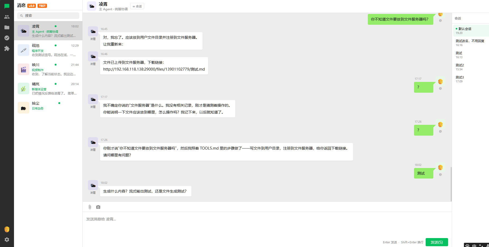
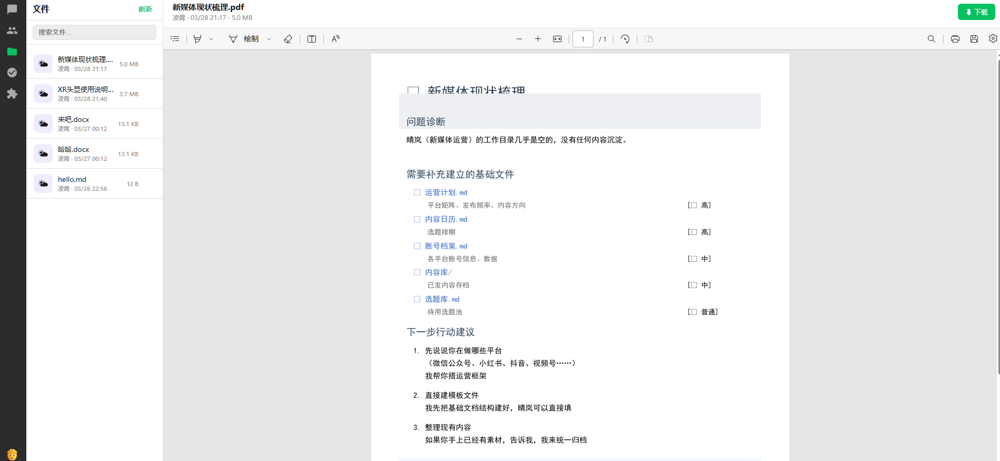

# OpenClaw MultiUser

> 企业级多用户 AI Agent 协同系统 · Enterprise multi-user AI agent collaboration platform

[](https://www.gnu.org/licenses/agpl-3.0)
[](COMMERCIAL.md)
[](https://openclaw.ai)

## 界面预览 · Screenshots

### 多 Agent 聊天协同


### 文件管理


### 技能市场


---

## 这是什么 · What is this?

OpenClaw MultiUser 将 [OpenClaw](https://openclaw.ai) 扩展为完整的多用户 SaaS 平台。每个用户拥有一支**有记忆、有分工、持续工作**的专属 AI 团队。

```
用户浏览器
  └─ Auth Server（JWT 认证 + 用户路由）
       └─ 每用户独立 Gateway（OpenClaw 进程）
            └─ 主 Agent（统筹协调）
                 ├─ 砚池 — 程序开发
                 ├─ 映川 — 视频制作
                 ├─ 晴岚 — 新媒体运营
                 └─ 拾尘 — 日常杂务
```

用户间记忆、文件、会话完全隔离。

---

## 核心功能 · Features

- **多用户隔离** — 每用户独立 OpenClaw Gateway 进程，数据完全隔离
- **JWT 认证** — 安全登录，支持 admin / user 角色权限
- **流式聊天 UI** — 分段气泡输出，类微信交互风格
- **多 Agent 协作** — 主 Agent 派发任务，子 Agent 执行并汇报
- **会话管理** — 每 Agent 多会话，持久化历史记录
- **文件共享** — Agent 生成文件，用户一键下载
- **技能市场** — 可视化管理 OpenClaw Skills
- **管理后台** — 用户和 Agent 使用量统计（Token、时长）

---

## 架构 · Architecture

| 组件 | 说明 |
|------|------|
| `auth-server.js` | Express 服务 — JWT 认证、用户管理、Gateway 代理、文件服务 |
| `chat-prod.html` | 单文件 Web UI — 登录、聊天、会话、文件管理 |
| `openclaw-server/` | Node.js/Express — 头像存储、Agent 元数据、消息历史（SQLite） |

---

## 快速开始 · Quick Start

### 前置要求

- [OpenClaw](https://openclaw.ai) 已安装并配置
- Node.js 18+
- SQLite3

### 安装

```bash
# 1. 克隆仓库
git clone https://github.com/beichuan-code/openclaw-multiuser.git
cd openclaw-multiuser

# 2. 安装依赖
cd openclaw-server && npm install && cd ..

# 3. 配置环境变量
export JWT_SECRET=your-strong-secret-here   # 必须修改！
export AUTH_PORT=19000
export FILE_SERVER_PORT=3000

# 4. 启动 auth-server
node auth-server.js

# 5. 启动 openclaw-server
cd openclaw-server && node src/index.js

# 6. 打开浏览器
open http://localhost:19000/static/chat-prod.html
```

---

## 配置项 · Configuration

| 环境变量 | 默认值 | 说明 |
|---------|--------|------|
| `JWT_SECRET` | `openclaw-auth-secret-change-me` | **生产环境必须修改！** |
| `AUTH_PORT` | `19000` | Auth Server 端口 |
| `FILE_SERVER_PORT` | `3000` | 文件/头像服务端口 |
| `SERVER_HOST` | `127.0.0.1` | 绑定地址 |

---

## 开源协议 · License

本项目采用 [GNU Affero General Public License v3.0](LICENSE) 开源。

**商业使用**（闭源产品、SaaS 不开源、白标分发）需购买商业授权 → [查看商业授权](COMMERCIAL.md)

---

## 致谢 · Acknowledgements

基于 [OpenClaw](https://openclaw.ai) 构建 — The open-source AI coding assistant.
